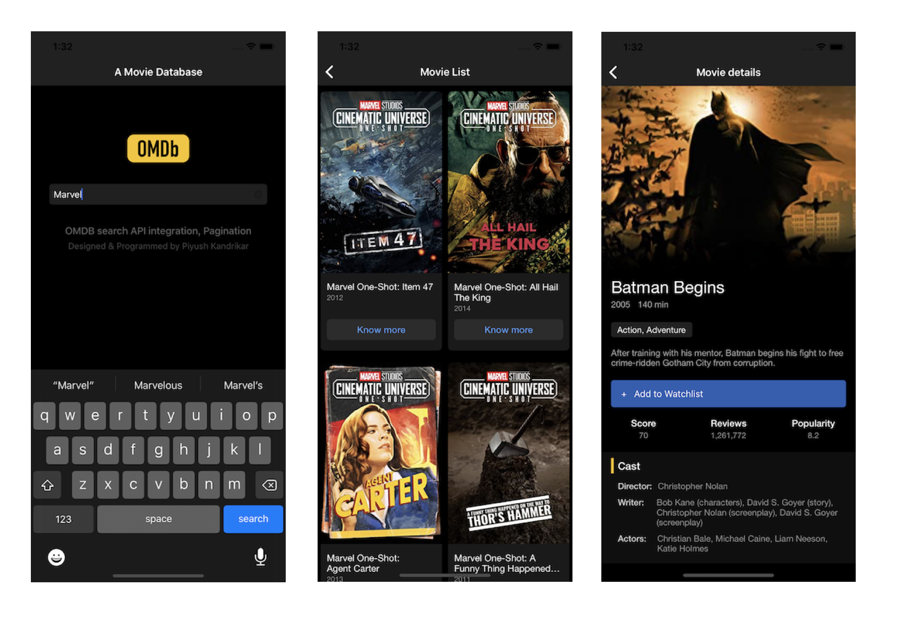

# OmdbApp
This will demonstrate how to call OMDBApi in iOS &amp; load data in UICollectionView with pagination.

# Repo URL
https://github.com/pkandrikar/OmdbApp.git

# Features Covered
1. Search any movie name from homepage of this app
2. Calling OMDB API to get movie list
3. Displaying results in UICollectionView with thumbnail image
4. Once user scrolls to the end of results it will fetch new data from API; pagination implemented
4. Tap on search result to Navigate to details page which will show the bigger image of thumbnail & other movie details
6. Image cache implemeted

# App Screenshot

# How to run this code
1. Open 'OMDB.xcodeproj' in latest xCode
2. Use cmd + r to run in any simulator OR you can run directly on iOS device

# Third-Party library used
- No third-party library has been used for this project
